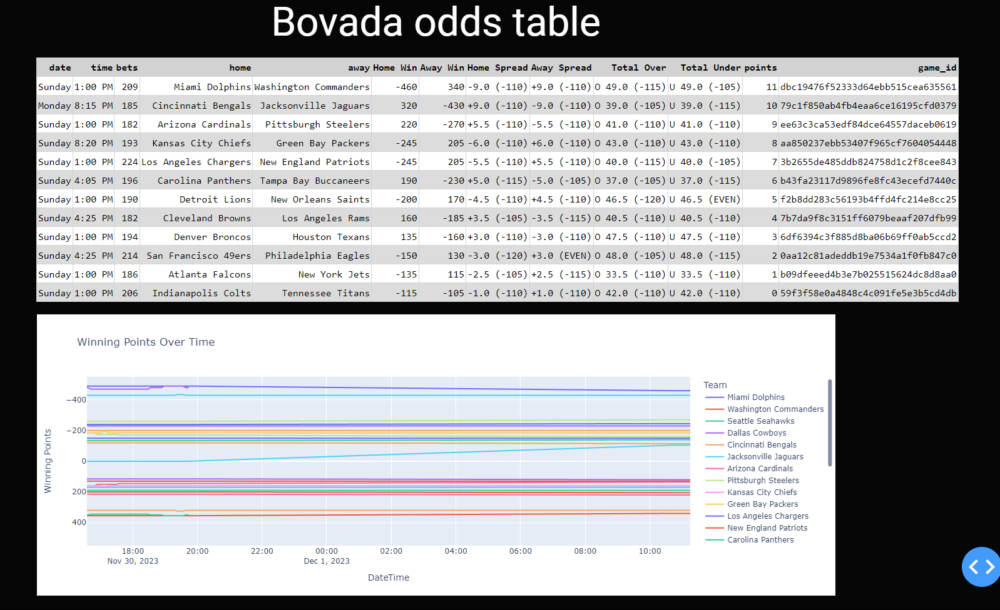

## Python NFL Bovada Dash

This is a Python Dash app used to generate a outlook on the win odds for my pickems league.

It scrapes current betting odds for this weeks NFL games

presents odds and points(rank) according to highest win odds

data is recorded to history (data_log.jsonl) every 5 mins while the script runs

history is presented in tooltip and via line graph

## steps:
- `pip install requirements.txt`
- `run main.py`
- navigate to `http://localhost:8050`

## todo:
- get wins to compare against history rating for a confidence rating
- make it look better
- reorder table columns to put points after bets
- add graph for points and possibly rename points to rank